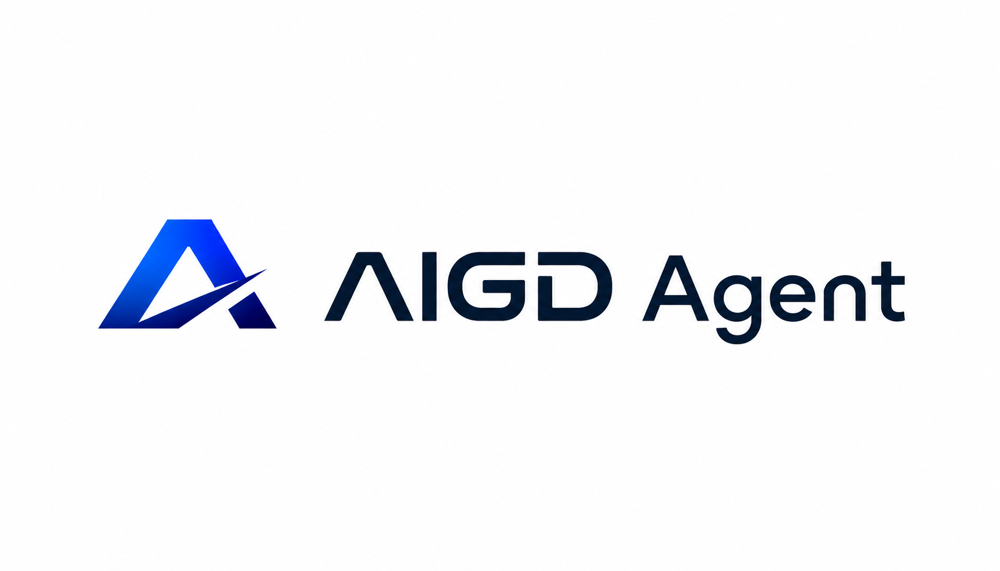

<div align="center">
  
</div>

# 🚀 AIGD Agent

AIGD Agent adalah sistem navigasi kesehatan cerdas yang dirancang untuk memberikan rekomendasi triase dan fasilitasi pemesanan layanan kesehatan secara efisien. Sistem ini memanfaatkan kecerdasan buatan untuk mengurai keluhan medis secara instan dan mengarahkan pengguna ke fasilitas penanganan yang paling tepat.

---

## 💡 Core Concept

Proyek ini dibangun dengan mengikuti panduan **"Membangun dengan Google Antigravity"**. Tujuannya adalah untuk menciptakan sebuah sistem navigasi kesehatan otonom yang tidak hanya reaktif, tetapi juga proaktif dalam menganalisis data awal pasien dan merekomendasikan rute perawatan yang optimal, guna mengurangi penumpukan antrean di Instalasi Gawat Darurat (IGD) yang tidak semestinya.

---

## 🛠 Tech Stack

- **Gemini 2.0 Flash**: Model bahasa multimodal dari Google Vertex AI yang digunakan sebagai otak pemrosesan utama, mampu memahami teks, suara, dan gambar dengan kecepatan tinggi.
- **Tool Calling Integration**: Memungkinkan agen AI untuk berinteraksi langsung dengan API eksternal (seperti Google Maps untuk navigasi dan Firebase/Firestore untuk penjadwalan) secara dinamis.
- **Next.js 14**: Framework React untuk frontend yang responsif dan server-side rendering.
- **Tailwind CSS**: Utility-first CSS framework untuk desain UI yang modern.

---

## ✨ Key Features & Skills

Agen ini dilengkapi dengan kemampuan multimodal tingkat lanjut:
- 🎙️ **Voice Intake**: Memungkinkan pengguna untuk menyampaikan keluhan gejala secara lisan. Agen akan mentranskripsi dan menganalisis sentimen serta tingkat urgensi medis.
- 📸 **Image Analysis**: Memproses unggahan gambar (seperti luka ringan atau hasil tes sederhana) untuk memberikan konteks tambahan dalam penentuan prioritas triase.
- 🗺️ **Geo-routing**: Menganalisis lokasi pengguna untuk merekomendasikan rute navigasi terbaik ke fasilitas kesehatan (IGD, Klinik, atau Telemedicine).

> Pengembangan berbagai kemampuan (*skills*) pada agen ini sepenuhnya mematuhi prinsip-prinsip yang tertuang dalam dokumen **"Authoring Google Antigravity Skills"**.

---

## ⚙️ Technical Workflow

AIGD Agent bekerja sebagai agen otonom yang beroperasi dalam siklus kognitif berkelanjutan:

1. **Reasoning (Pemikiran)**: Menganalisis input pengguna (teks/suara/gambar) menggunakan Gemini 2.0 Flash untuk memahami konteks dan mengekstraksi entitas medis yang relevan tanpa mendiagnosis.
2. **Tool Use (Penggunaan Alat)**: Menentukan alat/fungsi yang tepat untuk dipanggil (*Function Calling*), seperti kueri database Firestore untuk mencari ketersediaan dokter atau pemanggilan Google Maps API untuk rute.
3. **Action (Tindakan)**: Mengeksekusi pemanggilan alat tersebut dan merangkum hasil akhirnya menjadi rekomendasi navigasi kesehatan yang siap diakses pengguna.

Arsitektur spesifikasi dari ADK (*Agent Development Kit*) ini disusun secara sistematis berdasarkan dokumen referensi **"Pengembangan Agen ADK Berbasis Spesifikasi dengan Antigravity dan Spec-kit"**.


---

## 🚀 Installation & Setup

Untuk memulai menjalankan agen secara lokal, ikuti langkah persiapan cepat yang merujuk pada **"Mulai Menggunakan Google Antigravity"**:

1. **Clone Repository**:
   ```bash
   git clone https://github.com/RaditRamadani/AIGD-Agent-Triage.git
   cd AIGD-Agent-Triage
   ```

2. **Install Dependencies**:
   ```bash
   npm install
   ```

3. **Environment Setup**:
   Buat file `.env.local` dan isi kunci API yang diperlukan (Google Gemini, Google Maps, dan konfigurasi Firebase).

4. **Run Development Server**:
   ```bash
   npm run dev
   ```
   Aplikasi akan berjalan pada `http://localhost:3000`.

---

## 🤝 Footer

Didevelop oleh **Tim Error 404**

**⚠️ Disclaimer Kesehatan**:
*AIGD Agent adalah sistem navigasi fasilitas kesehatan, bukan alat diagnostik medis. Sistem ini tidak memberikan diagnosis penyakit, tidak meresepkan obat, dan tidak memberikan panduan klinis. Dalam keadaan darurat medis, segera hubungi layanan gawat darurat profesional.*
