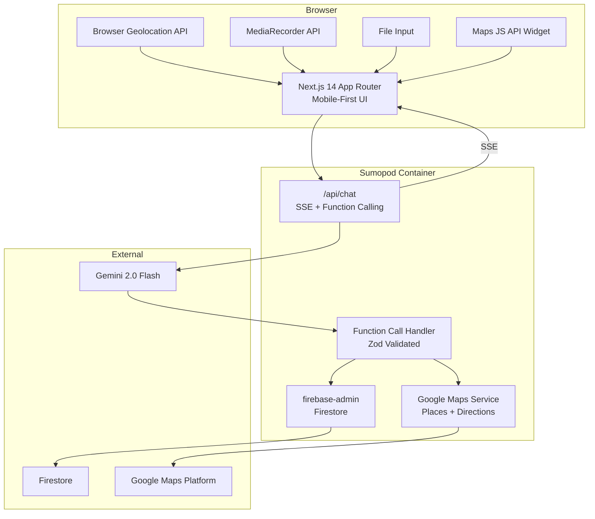
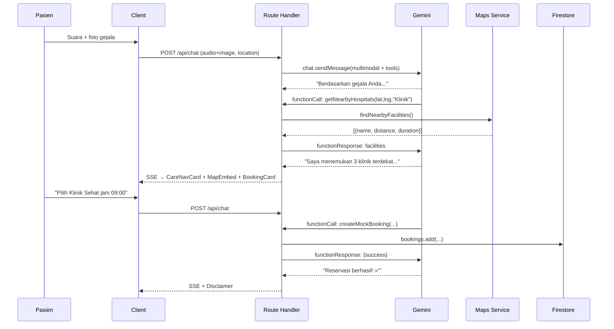

# AIGD Agent v3.0 — Implementation Plan

Rencana implementasi teknis berdasarkan [spec.md v3.0](file:///d:/Coding/AIGD%20Agent/spec.md).

---

## Open Questions

> [!IMPORTANT]
> **Tailwind CSS Version:** Shadcn UI terbaru default ke Tailwind v4. Gunakan v3 (stabil) atau v4?

> [!IMPORTANT]
> **Dummy Data Faskes:** Sudah punya data faskes Surabaya, atau perlu dibuatkan seed data dummy (5–10 faskes)?

> [!IMPORTANT]
> **Maps API Key:** Apakah `GOOGLE_MAPS_API_KEY` sudah di-enable untuk Places API, Directions API, DAN Maps JavaScript API di GCP Console?

---

## 1. Arsitektur



---

## 2. Project Structure

```
./
├── Dockerfile
├── .dockerignore
├── next.config.mjs            # output: 'standalone'
├── package.json
├── .env.local
└── src/
    ├── app/
    │   ├── layout.tsx
    │   ├── page.tsx
    │   ├── chat/page.tsx       # Halaman utama
    │   └── api/chat/route.ts   # SSE + Function Calling
    ├── components/chat/
    │   ├── ChatContainer.tsx
    │   ├── MessageBubble.tsx
    │   ├── CareNavCard.tsx     # Kartu rekomendasi navigasi
    │   ├── BookingCard.tsx
    │   ├── MapEmbed.tsx        # Peta interaktif
    │   ├── VoiceRecorder.tsx
    │   ├── ImageUploader.tsx
    │   └── DisclaimerBanner.tsx
    ├── lib/
    │   ├── gemini/
    │   │   ├── client.ts       # GoogleGenAI singleton
    │   │   ├── system-prompt.ts
    │   │   └── tools.ts        # Function declarations
    │   ├── firebase/
    │   │   ├── admin.ts        # Firestore singleton
    │   │   └── seed.ts         # Data dummy faskes
    │   ├── geo/
    │   │   └── maps-service.ts # Places + Directions
    │   ├── schemas/
    │   │   └── function-schemas.ts
    │   └── handlers/
    │       └── function-handler.ts
    └── types/index.ts
```

---

## 3. Proposed Changes

### 3.1 Core AI — Gemini 2.0 Flash

#### [NEW] `src/lib/gemini/client.ts`

```typescript
import { GoogleGenAI } from '@google/genai';
export const ai = new GoogleGenAI({ apiKey: process.env.GOOGLE_AI_API_KEY! });
```

#### [NEW] `src/lib/gemini/system-prompt.ts`

System instruction untuk Gemini. Konten:
- **Peran:** Navigator kesehatan, BUKAN dokter
- **Care Navigation:** 3 jalur output:
  - 🏥 **IGD** — gejala darurat → arahkan langsung via Maps
  - 🏪 **Puskesmas/Klinik** — perlu pemeriksaan → cari faskes → booking
  - 📱 **Telemedicine/Self-care** — gejala ringan → anjuran
- **Reasoning:** Wajib penjelasan bahasa awam di setiap rekomendasi
- **Batasan:** Tidak diagnosa, tidak resep obat
- **Disclaimer:** Wajib di akhir setiap respons
- **Tools:** Kapan panggil `getNearbyHospitals` dan `createMockBooking`

#### [NEW] `src/lib/gemini/tools.ts`

Menggunakan `Type` enum dari `@google/genai`:

```typescript
import { Type } from '@google/genai';

export const getNearbyHospitalsDeclaration = {
  name: 'getNearbyHospitals',
  description: 'Cari faskes terdekat dari lokasi pasien berdasarkan hasil Care Navigation.',
  parameters: {
    type: Type.OBJECT,
    properties: {
      lat: { type: Type.NUMBER, description: 'Latitude lokasi pasien' },
      lng: { type: Type.NUMBER, description: 'Longitude lokasi pasien' },
      facility_type: {
        type: Type.STRING,
        enum: ['Puskesmas', 'Klinik', 'IGD'],
        description: 'Jenis faskes sesuai hasil Care Navigation',
      },
      radius_meters: { type: Type.NUMBER, description: 'Radius pencarian (meter)' },
    },
    required: ['lat', 'lng', 'facility_type'],
  },
};

export const createMockBookingDeclaration = {
  name: 'createMockBooking',
  description: 'Buat reservasi simulasi di faskes yang dipilih pasien.',
  parameters: {
    type: Type.OBJECT,
    properties: {
      facility_id: { type: Type.STRING, description: 'ID faskes' },
      facility_name: { type: Type.STRING, description: 'Nama faskes' },
      patient_name: { type: Type.STRING, description: 'Nama pasien' },
      patient_contact: { type: Type.STRING, description: 'No. HP/WA pasien' },
      symptoms_summary: { type: Type.STRING, description: 'Ringkasan gejala' },
      care_navigation: {
        type: Type.STRING,
        enum: ['IGD', 'Puskesmas/Klinik', 'Telemedicine/Self-care'],
        description: 'Hasil Care Navigation',
      },
      reasoning: { type: Type.STRING, description: 'Alasan rekomendasi (bahasa awam)' },
      preferred_time: { type: Type.STRING, description: 'Waktu pilihan (HH:mm)' },
    },
    required: ['facility_id', 'facility_name', 'patient_name', 'patient_contact',
               'symptoms_summary', 'care_navigation', 'reasoning'],
  },
};
```

---

### 3.2 Geo-Module — Google Maps Server-Side

#### [NEW] `src/lib/geo/maps-service.ts`

```typescript
import { Client, PlaceType1, TravelMode } from '@googlemaps/google-maps-services-js';

const mapsClient = new Client({});

export async function findNearbyFacilities(
  lat: number, lng: number, facilityType: string, radiusMeters = 5000
) {
  const keyword = facilityType === 'IGD' ? 'IGD rumah sakit'
    : facilityType === 'Puskesmas' ? 'puskesmas' : 'klinik';

  const places = await mapsClient.placesNearby({
    params: {
      location: { lat, lng },
      radius: radiusMeters,
      keyword,
      type: PlaceType1.hospital,
      key: process.env.GOOGLE_MAPS_API_KEY!,
    },
    timeout: 5000,
  });

  const top5 = places.data.results.slice(0, 5);

  // Enrich setiap faskes dengan jarak + waktu via Directions API
  return Promise.all(top5.map(async (place) => {
    const dest = place.geometry!.location;
    let distance_km = null, duration_minutes = null;
    try {
      const dir = await mapsClient.directions({
        params: {
          origin: { lat, lng },
          destination: dest,
          mode: TravelMode.driving,
          key: process.env.GOOGLE_MAPS_API_KEY!,
        },
      });
      const leg = dir.data.routes[0]?.legs[0];
      if (leg) {
        distance_km = Math.round((leg.distance.value / 1000) * 10) / 10;
        duration_minutes = Math.round(leg.duration.value / 60);
      }
    } catch {}
    return {
      place_id: place.place_id,
      name: place.name,
      address: place.vicinity,
      location: dest,
      is_open: place.opening_hours?.open_now ?? null,
      distance_km,
      duration_minutes,
    };
  }));
}
```

---

### 3.3 Function Calling Handler

#### [NEW] `src/lib/schemas/function-schemas.ts`

```typescript
import { z } from 'zod';

export const GetNearbyHospitalsSchema = z.object({
  lat: z.number(),
  lng: z.number(),
  facility_type: z.enum(['Puskesmas', 'Klinik', 'IGD']),
  radius_meters: z.number().optional().default(5000),
});

export const CreateMockBookingSchema = z.object({
  facility_id: z.string(),
  facility_name: z.string(),
  patient_name: z.string(),
  patient_contact: z.string(),
  symptoms_summary: z.string(),
  care_navigation: z.enum(['IGD', 'Puskesmas/Klinik', 'Telemedicine/Self-care']),
  reasoning: z.string(),
  preferred_time: z.string().optional(),
});
```

#### [NEW] `src/lib/handlers/function-handler.ts`

Dispatcher: `getNearbyHospitals` → `findNearbyFacilities()`, `createMockBooking` → `createBooking()`.

---

### 3.4 Route Handler — `/api/chat`

#### [NEW] `src/app/api/chat/route.ts`

- Parse request: `messages`, `attachments` (base64), `location`
- Konversi ke format Gemini (text + `inlineData` untuk audio/image)
- `ai.chats.create()` dengan history + tool declarations
- Function calling loop (max 5 iterasi)
- Stream response via SSE (`text/event-stream`)
- Mandatory disclaimer di akhir

---

### 3.5 Firestore

#### [NEW] `src/lib/firebase/admin.ts`

Singleton `firebase-admin` + fungsi `createBooking()` dan `saveCareSession()`.

#### Koleksi

| Collection | Fields | Keterangan |
|---|---|---|
| `facilities` | `name`, `type`, `address`, `location`, `phone`, `operating_hours`, `services[]`, `available_slots[]` | Data faskes dummy |
| `bookings` | `facility_id`, `patient_name`, `patient_contact`, `appointment_time`, `care_result{care_navigation, reasoning, symptoms_summary}`, `status`, `created_at` | Booking simulasi |
| `care_sessions` | `session_id`, `created_at`, `care_navigation`, `reasoning`, `symptoms_extracted[]`, `input_modalities[]`, `booking_id` | Audit trail |

#### [NEW] `src/lib/firebase/seed.ts`

Seed 5–10 faskes dummy Surabaya dengan slot jadwal.

---

### 3.6 Deployment — Docker + Sumopod

#### [NEW] `Dockerfile`

3-stage build sesuai spec §7.2 (`node:20-alpine`, non-root user, `HOSTNAME=0.0.0.0`).

#### [NEW] `.dockerignore`

Sesuai spec §7.3.

#### Environment Variables (Sumopod Dashboard)

| Variable | Keterangan |
|---|---|
| `GOOGLE_AI_API_KEY` | Gemini 2.0 Flash |
| `GOOGLE_MAPS_API_KEY` | Places + Directions (server) |
| `NEXT_PUBLIC_GOOGLE_MAPS_API_KEY` | Maps JS API (client) |
| `FIREBASE_PROJECT_ID` | Firebase project |
| `FIREBASE_CLIENT_EMAIL` | Service account |
| `FIREBASE_PRIVATE_KEY` | Service account key |

---

### 3.7 UI Components

| Component | Fungsi |
|---|---|
| `ChatContainer` | Wrapper + `useReducer` state + SSE consumer |
| `MessageBubble` | Bubble user vs AI |
| `CareNavCard` | Kartu rekomendasi navigasi (IGD/Puskesmas/Telemedicine) + reasoning |
| `BookingCard` | Pilihan faskes + slot + tombol booking |
| `MapEmbed` | Peta interaktif (markers faskes, info window, tombol navigasi) |
| `VoiceRecorder` | Tombol mic besar + MediaRecorder API |
| `ImageUploader` | Upload foto + preview |
| `DisclaimerBanner` | Banner sticky disclaimer medis |

Prinsip UX (spec §9): voice-first, mobile-first (375px), font 18px, touch ≥ 48px, kontras ≥ 4.5:1.

---

## 4. Agentic Flow



---

## 5. Verification Plan

### Automated
| Test | Command |
|---|---|
| Build | `npm run build` |
| Lint | `npm run lint` |
| Docker build | `docker build -t aigd-agent:latest .` |

### Manual
| Skenario | Expected |
|---|---|
| Kirim teks | Streaming + Care Navigation + reasoning |
| Record suara | Audio → Gemini analisis |
| Upload foto | Image konteks tambahan |
| Gejala perlu pemeriksaan | → Puskesmas/Klinik → `getNearbyHospitals` → peta |
| Gejala darurat | → IGD → arahkan via Maps (tanpa booking) |
| Gejala ringan | → Telemedicine/Self-care → anjuran |
| Booking flow | Pilih faskes → `createMockBooking` → Firestore |
| Reasoning | Setiap rekomendasi ada penjelasan bahasa awam |
| Mobile | 375px viewport, touch ≥ 48px |
| Sumopod | App berjalan via URL |
