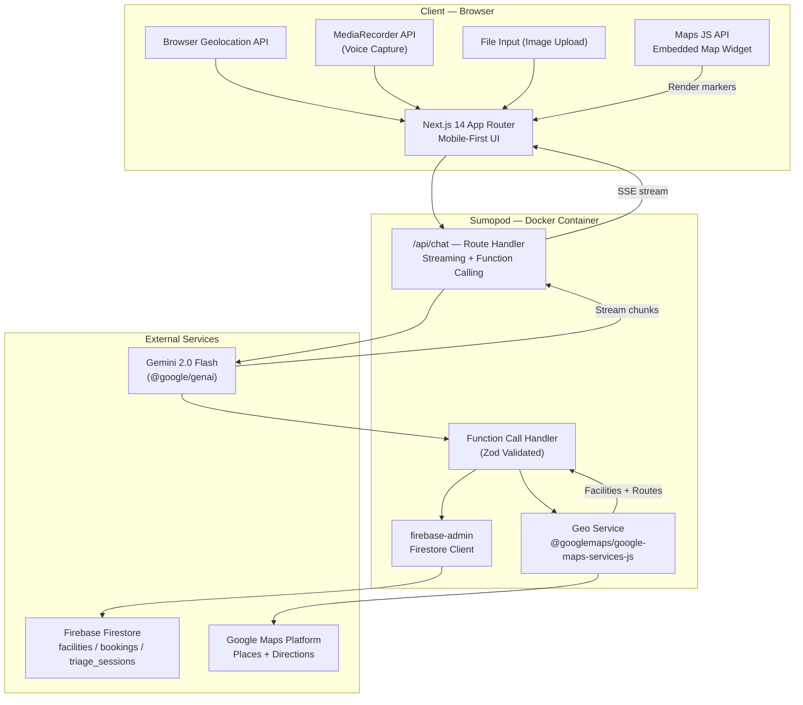
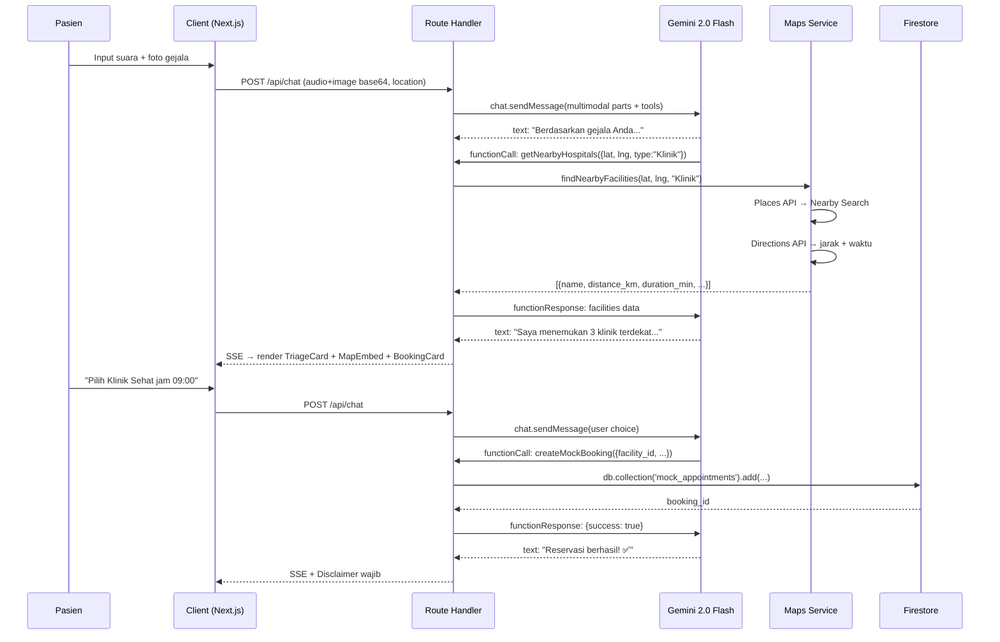

# AIGD Agent v3.0 — Implementation Plan

Rencana implementasi teknis mendalam berdasarkan [spec.md v3.0](file:///d:/Coding/AIGD%20Agent/spec.md).

---

## User Review Required

> [!IMPORTANT]
> **Google Maps SDK Choice:** Spec menyebut `google-maps-services-js`. Library ini adalah legacy wrapper untuk Places API & Directions API (web services). Masih stabil dan cocok untuk MVP karena autentikasi hanya butuh API Key (bukan ADC). Alternatif modern (`@googlemaps/places` + `@googlemaps/routing`) memerlukan ADC setup yang lebih kompleks. **Rekomendasi: tetap pakai `@googlemaps/google-maps-services-js` untuk MVP.**

> [!WARNING]
> **Firebase Auth:** Spec tidak menyebutkan autentikasi. Untuk MVP hackathon, **tanpa login** — session tracking via anonymous ID di `localStorage`. Setuju?

> [!IMPORTANT]
> **Tailwind CSS:** Shadcn UI terbaru default ke Tailwind v4. Apakah ingin v3 (stabil) atau v4?

## Open Questions

1. **Dummy Data Faskes:** Sudah punya data faskes Surabaya, atau saya buatkan seed 5–10 faskes dummy?
2. **Maps JS API Key:** Apakah `GOOGLE_MAPS_API_KEY` sudah di-enable untuk Places API, Directions API, DAN Maps JavaScript API di GCP Console?

---

## 1. Architecture Overview



---

## 2. Project Structure

```
./
├── Dockerfile
├── .dockerignore
├── next.config.mjs
├── package.json
├── .env.local
├── tsconfig.json
└── src/
    ├── app/
    │   ├── layout.tsx
    │   ├── page.tsx
    │   ├── chat/
    │   │   └── page.tsx
    │   └── api/
    │       └── chat/
    │           └── route.ts
    ├── components/
    │   ├── ui/                     # Shadcn UI
    │   └── chat/
    │       ├── ChatContainer.tsx
    │       ├── MessageBubble.tsx
    │       ├── TriageCard.tsx
    │       ├── BookingCard.tsx
    │       ├── MapEmbed.tsx        # [NEW] Google Maps widget
    │       ├── VoiceRecorder.tsx
    │       ├── ImageUploader.tsx
    │       └── DisclaimerBanner.tsx
    ├── lib/
    │   ├── gemini/
    │   │   ├── client.ts
    │   │   ├── system-prompt.ts
    │   │   └── tools.ts            # Function declarations (Type enum)
    │   ├── firebase/
    │   │   ├── admin.ts
    │   │   └── seed.ts
    │   ├── geo/
    │   │   └── maps-service.ts     # [NEW] Google Maps server-side
    │   ├── schemas/
    │   │   └── function-schemas.ts
    │   ├── handlers/
    │   │   └── function-handler.ts
    │   └── utils.ts
    └── types/
        └── index.ts
```

---

## 3. Dependencies

```json
{
  "dependencies": {
    "next": "^14.2",
    "react": "^18.3",
    "react-dom": "^18.3",
    "@google/genai": "^1.x",
    "@googlemaps/google-maps-services-js": "^3.x",
    "@googlemaps/js-api-loader": "^1.x",
    "firebase-admin": "^12.x",
    "zod": "^3.23",
    "lucide-react": "^0.4"
  },
  "devDependencies": {
    "typescript": "^5.5",
    "@types/node": "^20",
    "@types/react": "^18"
  }
}
```

> **Catatan:** `zod-to-json-schema` **dihapus**. Kita langsung pakai `Type` enum dari `@google/genai` untuk deklarasi tools (sesuai API surface terbaru).

---

## 4. AI Integration — `@google/genai`

### 4.1 Gemini Client Singleton

#### [NEW] [client.ts](file:///d:/Coding/AIGD%20Agent/src/lib/gemini/client.ts)

```typescript
import { GoogleGenAI } from '@google/genai';

export const ai = new GoogleGenAI({
  apiKey: process.env.GOOGLE_AI_API_KEY!,
});
```

### 4.2 Function Declarations — `Type` Enum

#### [NEW] [tools.ts](file:///d:/Coding/AIGD%20Agent/src/lib/gemini/tools.ts)

Menggunakan `Type` enum dari `@google/genai` secara langsung (tanpa zod-to-json-schema converter):

```typescript
import { Type } from '@google/genai';

export const getNearbyHospitalsDeclaration = {
  name: 'getNearbyHospitals',
  description: 'Cari fasilitas kesehatan (rumah sakit, klinik, puskesmas) terdekat dari lokasi pasien berdasarkan hasil triase. Mengembalikan daftar faskes dengan jarak dan estimasi waktu tempuh.',
  parameters: {
    type: Type.OBJECT,
    properties: {
      lat: {
        type: Type.NUMBER,
        description: 'Latitude lokasi pasien',
      },
      lng: {
        type: Type.NUMBER,
        description: 'Longitude lokasi pasien',
      },
      facility_type: {
        type: Type.STRING,
        enum: ['Puskesmas', 'Klinik', 'IGD'],
        description: 'Jenis fasilitas kesehatan yang dicari berdasarkan hasil triase',
      },
      radius_meters: {
        type: Type.NUMBER,
        description: 'Radius pencarian dalam meter (default: 5000)',
      },
    },
    required: ['lat', 'lng', 'facility_type'],
  },
};

export const createMockBookingDeclaration = {
  name: 'createMockBooking',
  description: 'Buat reservasi simulasi di fasilitas kesehatan yang dipilih pasien. Simpan data booking ke Firestore.',
  parameters: {
    type: Type.OBJECT,
    properties: {
      facility_id: {
        type: Type.STRING,
        description: 'ID faskes dari hasil pencarian getNearbyHospitals',
      },
      facility_name: {
        type: Type.STRING,
        description: 'Nama faskes yang dipilih',
      },
      patient_name: {
        type: Type.STRING,
        description: 'Nama lengkap pasien',
      },
      patient_contact: {
        type: Type.STRING,
        description: 'Nomor telepon/WhatsApp pasien',
      },
      symptoms_summary: {
        type: Type.STRING,
        description: 'Ringkasan gejala pasien untuk faskes',
      },
      urgency_level: {
        type: Type.STRING,
        enum: ['Red', 'Yellow', 'Green'],
        description: 'Tingkat urgensi hasil triase',
      },
      preferred_time: {
        type: Type.STRING,
        description: 'Waktu kunjungan yang dipilih (format HH:mm)',
      },
    },
    required: ['facility_id', 'facility_name', 'patient_name', 'patient_contact', 'symptoms_summary', 'urgency_level'],
  },
};

export const toolDeclarations = [
  getNearbyHospitalsDeclaration,
  createMockBookingDeclaration,
];
```

### 4.3 Route Handler — Streaming + Function Calling Loop

#### [NEW] [route.ts](file:///d:/Coding/AIGD%20Agent/src/app/api/chat/route.ts)

```typescript
import { ai } from '@/lib/gemini/client';
import { SYSTEM_PROMPT } from '@/lib/gemini/system-prompt';
import { toolDeclarations } from '@/lib/gemini/tools';
import { handleFunctionCall } from '@/lib/handlers/function-handler';

export const dynamic = 'force-dynamic';

export async function POST(req: Request) {
  const { messages, attachments, location } = await req.json();
  const contents = buildContents(messages, attachments, location);

  const config = {
    systemInstruction: SYSTEM_PROMPT,
    tools: [{ functionDeclarations: toolDeclarations }],
  };

  // Use Chat API for multi-turn with automatic history
  const chat = ai.chats.create({
    model: 'gemini-2.0-flash',
    config,
    history: contents.slice(0, -1), // previous turns
  });

  const encoder = new TextEncoder();
  const stream = new ReadableStream({
    async start(controller) {
      const enqueue = (data: object) => {
        controller.enqueue(encoder.encode(`data: ${JSON.stringify(data)}\n\n`));
      };

      // Send latest message
      const lastMessage = contents[contents.length - 1];
      let response = await chat.sendMessage({ message: lastMessage.parts });

      // Function calling loop (max 5 iterations for safety)
      let iterations = 0;
      while (response.functionCalls?.length && iterations < 5) {
        const functionResponses = [];

        for (const fc of response.functionCalls) {
          const result = await handleFunctionCall(fc);
          enqueue({ type: 'tool', name: fc.name, data: result });
          functionResponses.push({
            functionResponse: { name: fc.name, response: result, id: fc.id },
          });
        }

        // Send function results back to model
        response = await chat.sendMessage({
          message: functionResponses,
        });
        iterations++;
      }

      // Stream final text
      if (response.text) {
        enqueue({ type: 'text', data: response.text });
      }

      // Mandatory disclaimer
      enqueue({
        type: 'disclaimer',
        data: '⚕️ Sistem ini adalah navigator kesehatan, bukan dokter. Rekomendasi yang diberikan bukan diagnosis medis final.',
      });

      controller.close();
    },
  });

  return new Response(stream, {
    headers: {
      'Content-Type': 'text/event-stream',
      'Cache-Control': 'no-cache',
      'Connection': 'keep-alive',
    },
  });
}

function buildContents(messages: any[], attachments: any[], location: any) {
  return messages.map((msg: any, i: number) => {
    const parts: any[] = [{ text: msg.content }];

    // Attach multimodal data to last user message
    if (i === messages.length - 1 && msg.role === 'user') {
      if (attachments?.length) {
        for (const att of attachments) {
          parts.push({
            inlineData: { mimeType: att.type, data: att.data },
          });
        }
      }
      if (location) {
        parts[0].text += `\n[Lokasi pasien: ${location.lat}, ${location.lng}]`;
      }
    }

    return { role: msg.role === 'user' ? 'user' : 'model', parts };
  });
}
```

### 4.4 System Prompt

#### [NEW] [system-prompt.ts](file:///d:/Coding/AIGD%20Agent/src/lib/gemini/system-prompt.ts)

Berisi instruksi peran, protokol triase (Red/Yellow/Green), aturan komunikasi Bahasa Indonesia awam, batasan non-diagnosis, dan mandatory disclaimer.

---

## 5. Geo-Module — `@googlemaps/google-maps-services-js`

### 5.1 Maps Service (Server-Side)

#### [NEW] [maps-service.ts](file:///d:/Coding/AIGD%20Agent/src/lib/geo/maps-service.ts)

```typescript
import { Client, PlaceType1, TravelMode } from '@googlemaps/google-maps-services-js';

const mapsClient = new Client({});
const API_KEY = process.env.GOOGLE_MAPS_API_KEY!;

export interface NearbyFacility {
  place_id: string;
  name: string;
  address: string;
  location: { lat: number; lng: number };
  is_open: boolean | null;
  distance_km: number | null;
  duration_minutes: number | null;
}

/**
 * Cari faskes terdekat via Places API (Nearby Search)
 */
export async function findNearbyFacilities(
  lat: number,
  lng: number,
  facilityType: string,
  radiusMeters: number = 5000
): Promise<NearbyFacility[]> {
  // Map facility_type ke Places API keyword
  const keyword = mapFacilityTypeToKeyword(facilityType);

  const placesResponse = await mapsClient.placesNearby({
    params: {
      location: { lat, lng },
      radius: radiusMeters,
      keyword,
      type: PlaceType1.hospital,
      key: API_KEY,
    },
    timeout: 5000,
  });

  const places = placesResponse.data.results.slice(0, 5); // Top 5

  // Hitung jarak + waktu tempuh via Directions API
  const facilities: NearbyFacility[] = await Promise.all(
    places.map(async (place) => {
      const dest = place.geometry!.location;
      let distance_km: number | null = null;
      let duration_minutes: number | null = null;

      try {
        const dirResponse = await mapsClient.directions({
          params: {
            origin: { lat, lng },
            destination: { lat: dest.lat, lng: dest.lng },
            mode: TravelMode.driving,
            key: API_KEY,
          },
          timeout: 5000,
        });

        const leg = dirResponse.data.routes[0]?.legs[0];
        if (leg) {
          distance_km = Math.round((leg.distance.value / 1000) * 10) / 10;
          duration_minutes = Math.round(leg.duration.value / 60);
        }
      } catch {
        // Fallback: jarak tidak tersedia
      }

      return {
        place_id: place.place_id!,
        name: place.name!,
        address: place.vicinity || '',
        location: { lat: dest.lat, lng: dest.lng },
        is_open: place.opening_hours?.open_now ?? null,
        distance_km,
        duration_minutes,
      };
    })
  );

  return facilities.sort((a, b) => (a.distance_km ?? 99) - (b.distance_km ?? 99));
}

function mapFacilityTypeToKeyword(type: string): string {
  switch (type) {
    case 'IGD': return 'IGD rumah sakit';
    case 'Puskesmas': return 'puskesmas';
    case 'Klinik': return 'klinik';
    default: return 'rumah sakit';
  }
}
```

### 5.2 Client-Side Map Widget

#### [NEW] [MapEmbed.tsx](file:///d:/Coding/AIGD%20Agent/src/components/chat/MapEmbed.tsx)

Menggunakan `@googlemaps/js-api-loader` untuk render peta interaktif:
- Marker lokasi pasien
- Marker setiap faskes hasil pencarian
- Info window dengan nama, jarak, waktu tempuh
- Tombol "Navigasi" → buka Google Maps app

---

## 6. Function Call Handler

### 6.1 Zod Schemas

#### [NEW] [function-schemas.ts](file:///d:/Coding/AIGD%20Agent/src/lib/schemas/function-schemas.ts)

```typescript
import { z } from 'zod';

export const GetNearbyHospitalsSchema = z.object({
  lat: z.number(),
  lng: z.number(),
  facility_type: z.enum(['Puskesmas', 'Klinik', 'IGD']),
  radius_meters: z.number().optional().default(5000),
});

export const CreateMockBookingSchema = z.object({
  facility_id: z.string(),
  facility_name: z.string(),
  patient_name: z.string(),
  patient_contact: z.string(),
  symptoms_summary: z.string(),
  urgency_level: z.enum(['Red', 'Yellow', 'Green']),
  preferred_time: z.string().optional(),
});
```

### 6.2 Handler Dispatcher

#### [NEW] [function-handler.ts](file:///d:/Coding/AIGD%20Agent/src/lib/handlers/function-handler.ts)

```typescript
import { GetNearbyHospitalsSchema, CreateMockBookingSchema } from '@/lib/schemas/function-schemas';
import { findNearbyFacilities } from '@/lib/geo/maps-service';
import { createBooking } from '@/lib/firebase/admin';

interface FunctionCall {
  name: string;
  args: unknown;
  id?: string;
}

export async function handleFunctionCall(call: FunctionCall) {
  switch (call.name) {
    case 'getNearbyHospitals': {
      const params = GetNearbyHospitalsSchema.parse(call.args);
      const facilities = await findNearbyFacilities(
        params.lat, params.lng, params.facility_type, params.radius_meters
      );
      return { facilities, count: facilities.length };
    }
    case 'createMockBooking': {
      const params = CreateMockBookingSchema.parse(call.args);
      const booking = await createBooking(params);
      return { success: true, booking_id: booking.id, message: 'Reservasi berhasil dibuat' };
    }
    default:
      return { error: `Unknown function: ${call.name}` };
  }
}
```

---

## 7. Firestore — Schema & Operations

### 7.1 Firebase Admin Singleton

#### [NEW] [admin.ts](file:///d:/Coding/AIGD%20Agent/src/lib/firebase/admin.ts)

```typescript
import { initializeApp, cert, getApps } from 'firebase-admin/app';
import { getFirestore, Timestamp } from 'firebase-admin/firestore';

if (!getApps().length) {
  initializeApp({
    credential: cert({
      projectId: process.env.FIREBASE_PROJECT_ID,
      clientEmail: process.env.FIREBASE_CLIENT_EMAIL,
      privateKey: process.env.FIREBASE_PRIVATE_KEY?.replace(/\\n/g, '\n'),
    }),
  });
}

export const db = getFirestore();

export async function createBooking(params: {
  facility_id: string;
  facility_name: string;
  patient_name: string;
  patient_contact: string;
  symptoms_summary: string;
  urgency_level: string;
  preferred_time?: string;
}) {
  const docRef = await db.collection('mock_appointments').add({
    ...params,
    status: 'Confirmed',
    created_at: Timestamp.now(),
  });
  return { id: docRef.id };
}
```

### 7.2 Koleksi Firestore

| Collection | Key Fields | Keterangan |
|---|---|---|
| **`care_sessions`** | `session_id`, `created_at`, `urgency_level`, `reasoning`, `symptoms_extracted[]`, `input_modalities[]`, `care_navigation`, `booking_id` | Riwayat sesi triase (audit trail) |
| **`mock_appointments`** | `facility_id`, `facility_name`, `patient_name`, `patient_contact`, `symptoms_summary`, `urgency_level`, `preferred_time`, `status`, `created_at` | Booking simulasi hasil triase |
| **`facilities`** | `name`, `type`, `address`, `location`, `phone`, `operating_hours`, `services[]`, `available_slots[]` | Data faskes dummy (seed) |

### 7.3 Seed Script

#### [NEW] [seed.ts](file:///d:/Coding/AIGD%20Agent/src/lib/firebase/seed.ts)

Script `ts-node` mengisi 5–10 faskes dummy area Surabaya (Puskesmas, Klinik, RS) dengan slot jadwal kosong ke koleksi `facilities`.

---

## 8. Deployment — Docker + Sumopod

### 8.1 `next.config.mjs`

```javascript
/** @type {import('next').NextConfig} */
const nextConfig = { output: 'standalone' };
export default nextConfig;
```

### 8.2 Dockerfile — Multi-Stage Build

#### [NEW] Dockerfile

```dockerfile
# ── Stage 1: Dependencies ──
FROM node:20-alpine AS deps
WORKDIR /app
COPY package.json package-lock.json* ./
RUN npm ci

# ── Stage 2: Build ──
FROM node:20-alpine AS builder
WORKDIR /app
COPY --from=deps /app/node_modules ./node_modules
COPY . .
ENV NEXT_TELEMETRY_DISABLED=1
RUN npm run build

# ── Stage 3: Runner ──
FROM node:20-alpine AS runner
WORKDIR /app
ENV NODE_ENV=production
ENV NEXT_TELEMETRY_DISABLED=1

RUN addgroup --system --gid 1001 nodejs
RUN adduser --system --uid 1001 nextjs

COPY --from=builder /app/public ./public
COPY --from=builder --chown=nextjs:nodejs /app/.next/standalone ./
COPY --from=builder --chown=nextjs:nodejs /app/.next/static ./.next/static

USER nextjs
EXPOSE 3000
ENV PORT=3000
ENV HOSTNAME="0.0.0.0"

CMD ["node", "server.js"]
```

**Design decisions:**
- 3-stage → image ~150MB (vs ~1GB single-stage)
- `node:20-alpine` → base ringan
- Non-root user → keamanan container
- `HOSTNAME=0.0.0.0` → wajib untuk koneksi eksternal di Sumopod

### 8.3 `.dockerignore`

```
node_modules
.next
.git
*.md
.env*.local
.vscode
coverage
```

### 8.4 Environment Variables (Sumopod Dashboard)

| Variable | Keterangan |
|---|---|
| `GOOGLE_AI_API_KEY` | API key Gemini 2.0 Flash |
| `GOOGLE_MAPS_API_KEY` | API key Google Maps Platform |
| `NEXT_PUBLIC_GOOGLE_MAPS_API_KEY` | API key Maps JS (client-side) |
| `FIREBASE_PROJECT_ID` | Firebase project ID |
| `FIREBASE_CLIENT_EMAIL` | Service account email |
| `FIREBASE_PRIVATE_KEY` | Service account private key |

---

## 9. Agentic Flow — Sequence Diagram



---

## Verification Plan

### Automated
| # | Test | Command |
|---|---|---|
| 1 | Build | `npm run build` — zero errors |
| 2 | Lint | `npm run lint` — code quality |
| 3 | Zod validation | Unit test schemas valid/invalid |
| 4 | Docker build | `docker build -t aigd-agent:latest .` |
| 5 | Docker run | `docker run -p 3000:3000 --env-file .env.local aigd-agent:latest` |

### Manual / Browser
| # | Skenario | Expected |
|---|---|---|
| 1 | Kirim teks | Streaming response + triase |
| 2 | Record suara | Audio blob → Gemini analisis |
| 3 | Upload foto | Image dianalisis |
| 4 | Yellow trigger | `getNearbyHospitals()` → Maps API → facilities + map |
| 5 | Booking flow | `createMockBooking()` → dokumen di Firestore |
| 6 | Red trigger | Arahan IGD langsung (tanpa booking) |
| 7 | Mobile | Viewport 375px, touch ≥ 48px |
| 8 | Accessibility | Lighthouse ≥ 90 |
| 9 | Sumopod | App berjalan via URL |
 

