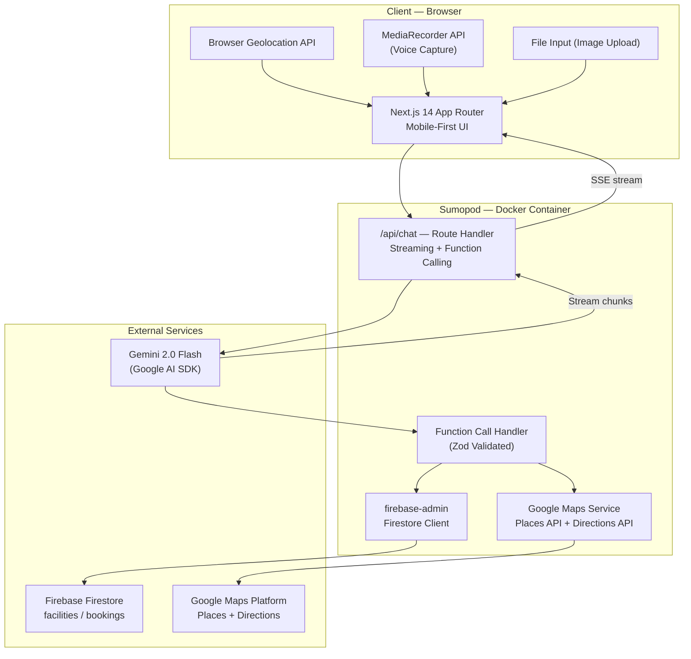
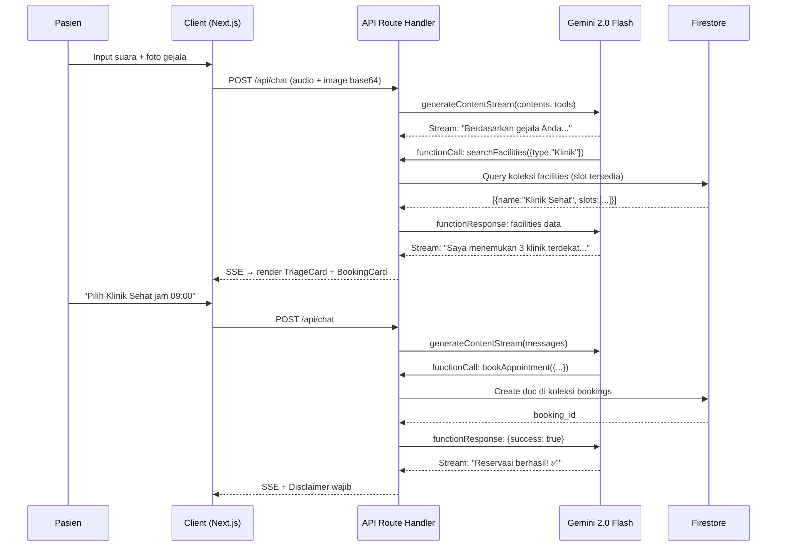

# Software Design Document: AIGD Agent v3.0

**Intelligent Healthcare Triaging — Sistem Agen Cerdas Multimodal**

| Field | Detail |
|---|---|
| **Versi** | SDD v3.0 |
| **Event** | GDG Surabaya · Mini Hackathon Antigravity 2026 |
| **Tim** | Error 404 |
| **Penyusun** | Mohammad Radithya Syah Ramadani · Dhani Putra |
| **Kategori** | Agentic AI · Multimodal Innovation |
| **Tech Stack** | Gemini 2.0 Flash · Google AI SDK · Firebase · Google Maps Platform · Next.js 14 · Docker |

---

## 1. Ringkasan Sistem

AIGD Agent adalah sistem agen cerdas berbasis **Agentic AI** yang berfungsi sebagai kontak pertama pasien sebelum mereka tiba di fasilitas kesehatan. Agen ini memahami kondisi pasien melalui tiga modalitas input — **suara, gambar, dan teks** — lalu secara otonom menentukan jalur perawatan yang paling tepat, menemukan fasilitas terdekat via Google Maps, dan menjadwalkan kunjungan.

**Output sistem adalah _Care Navigation_ (rekomendasi jenis faskes: IGD / Puskesmas-Klinik / Telemedicine), BUKAN diagnosis medis.**

### 1.1 Pipeline Arsitektur

```
Input → Processing → Orchestration → Geo-Routing → Output
(Voice/Image/Text)  (Gemini 2.0 Flash)  (Google AI SDK)  (Google Maps Platform)  (Care Nav + Scheduling)
```

---

## 2. Arsitektur Sistem

### 2.1 Diagram Arsitektur



### 2.2 Google Cloud Tech Stack

| Layer | Service | Fungsi |
|---|---|---|
| **CORE AI** | Gemini 2.0 Flash (Multimodal) | Proses audio, gambar, dan teks secara bersamaan. Bahasa Indonesia native support. |
| **AGENT** | Google AI SDK (`@google/genai`) | Gemini API wrapper resmi. Multi-turn conversation, function calling, dan tool use. |
| **GEO** | Google Maps Platform (Maps JS API + Places API + Directions API) | Deteksi lokasi pasien real-time. Cari faskes terdekat. Tampilkan rute, jarak, dan estimasi waktu tempuh. |
| **FRONTEND** | Next.js 14 (App Router) | Web app mobile-first dengan embedded Maps widget. |
| **DATABASE** | Firebase Firestore | Penyimpanan session pasien, slot faskes, dan riwayat booking. |

---

## 3. Core AI Layer — Multimodal Processing

### 3.1 Model & SDK

- **Model:** `gemini-2.0-flash` via Google AI SDK (`@google/genai`)
- **Kemampuan:** Memproses audio, gambar, dan teks secara **simultan** dalam satu request
- **Bahasa:** Bahasa Indonesia native

### 3.2 Tiga Modalitas Input

| Modalitas | Mekanisme | Deskripsi |
|---|---|---|
| 🎤 **Voice** | `MediaRecorder API` → audio blob → `inlineData` (base64) | Pasien cerita gejala dengan suara. Cocok untuk lansia dan daerah literasi digital rendah. |
| 📷 **Image** | File input → image blob → `inlineData` (base64) | Pasien foto kondisi fisik (ruam, luka, bengkak). Gemini Vision menganalisis sebagai konteks tambahan. |
| ✏️ **Text** | Text input langsung | Pasien mengetik keluhan dalam Bahasa Indonesia natural. |

### 3.3 Care Navigation Output

Output AI **bukan diagnosis medis**, melainkan rekomendasi navigasi:

| Rekomendasi | Kondisi | Tindakan Sistem |
|---|---|---|
| 🔴 **IGD** | Gejala darurat (sesak napas berat, pendarahan, dll.) | Arahkan langsung ke IGD terdekat via Maps. Tidak perlu booking. |
| 🟡 **Puskesmas / Klinik** | Gejala prioritas (demam berkepanjangan, infeksi, dll.) | Cari faskes terdekat → tampilkan slot → booking otonom. |
| 🟢 **Telemedicine / Self-care** | Gejala ringan (flu ringan, sakit kepala biasa, dll.) | Anjuran self-care atau konsultasi telemedicine. |

Setiap output **wajib** menyertakan:
- **Reasoning transparan** dalam bahasa awam (mengapa diarahkan ke faskes tersebut)
- **Disclaimer** bahwa ini bukan diagnosis medis final

---

## 4. Modul Geo-Aware — Google Maps Platform

### 4.1 Komponen Integrasi

| API | Fungsi |
|---|---|
| **Browser Geolocation API** | Deteksi koordinat (lat/lng) pasien dari browser |
| **Maps JavaScript API** | Render peta interaktif embedded di dalam app |
| **Places API (New)** | Pencarian faskes terdekat: query `hospital`, `clinic`, `puskesmas` berdasarkan lokasi pasien |
| **Directions API** | Hitung rute, jarak, dan estimasi waktu tempuh dari pasien ke faskes |

### 4.2 Alur Geo-Routing

1. Browser meminta izin lokasi → `navigator.geolocation.getCurrentPosition()`
2. Koordinat dikirim ke backend bersama hasil triase
3. Backend memanggil **Places API** untuk mencari faskes terdekat sesuai jenis rekomendasi
4. **Directions API** menghitung rute dan waktu tempuh untuk setiap faskes
5. Hasil ditampilkan di peta embedded dengan marker dan info window
6. Pasien bisa klik "Navigasi" → buka Google Maps app langsung

### 4.3 Spesifikasi API Endpoint — Geo

**`POST /api/geo/nearby`**

```json
// Request
{
  "lat": -7.2575,
  "lng": 112.7521,
  "facility_type": "Puskesmas",
  "radius_meters": 5000
}

// Response
{
  "facilities": [
    {
      "place_id": "ChIJ...",
      "name": "Puskesmas Mulyorejo",
      "address": "Jl. Mulyorejo No.45, Surabaya",
      "distance_km": 1.2,
      "duration_minutes": 8,
      "location": { "lat": -7.2601, "lng": 112.7683 },
      "is_open": true
    }
  ]
}
```

---

## 5. Agentic Workflow — Function Calling

### 5.1 Konsep

AIGD Agent bukan chatbot pasif. Menggunakan kapabilitas **Function Calling** pada Gemini, agen dapat secara otonom mengeksekusi aksi: mengecek ketersediaan slot faskes di Firestore dan melakukan simulasi booking.

### 5.2 Definisi Tools

```typescript
// Tool 1: Cari faskes + slot tersedia
{
  name: 'searchFacilities',
  description: 'Cari fasilitas kesehatan terdekat dengan slot tersedia',
  parameters: {
    facility_type: 'Puskesmas' | 'Klinik' | 'IGD',
    urgency_level: 'Red' | 'Yellow' | 'Green',
    preferred_date: 'YYYY-MM-DD' // optional
  }
}

// Tool 2: Booking appointment
{
  name: 'bookAppointment',
  description: 'Buat reservasi di fasilitas kesehatan yang dipilih pasien',
  parameters: {
    facility_id: string,
    slot_id: string,
    patient_name: string,
    patient_contact: string,
    symptoms_summary: string,
    triage_reasoning: string
  }
}
```

### 5.3 Alur Function Calling End-to-End



### 5.4 Spesifikasi API Endpoint — Chat

**`POST /api/chat`**

```json
// Request
{
  "messages": [
    { "role": "user", "content": "Saya demam 3 hari dan ada bercak merah" }
  ],
  "attachments": [
    { "type": "image/jpeg", "data": "<base64>" },
    { "type": "audio/webm", "data": "<base64>" }
  ],
  "location": { "lat": -7.2575, "lng": 112.7521 }
}

// Response: Server-Sent Events stream
data: {"type": "text", "data": "Berdasarkan cerita Ibu..."}
data: {"type": "triage", "data": {"level": "Yellow", "reasoning": "..."}}
data: {"type": "facilities", "data": [{"name": "...", "slots": [...]}]}
data: {"type": "disclaimer", "data": "Sistem ini adalah navigator kesehatan..."}
```

---

## 6. Desain Database — Firestore

### 6.1 Koleksi `facilities`

Menyimpan data faskes dan ketersediaan jadwal (data dummy untuk MVP).

| Field | Type | Keterangan |
|---|---|---|
| `facility_id` | `string` (Doc ID) | ID unik faskes |
| `name` | `string` | Contoh: "Puskesmas Mulyorejo Surabaya" |
| `type` | `string` | `"Puskesmas"` \| `"Klinik"` \| `"IGD"` |
| `address` | `string` | Alamat lengkap |
| `location` | `GeoPoint` | Koordinat lat/lng faskes |
| `phone` | `string` | Nomor telepon |
| `operating_hours` | `string` | Contoh: "08:00–16:00" |
| `services` | `array<string>` | Layanan tersedia |
| `available_slots` | `array<map>` | Daftar jadwal kosong |
| ↳ `slot_id` | `string` | ID slot unik |
| ↳ `time` | `Timestamp` | Waktu slot |
| ↳ `is_booked` | `boolean` | Status booking |

### 6.2 Koleksi `bookings`

Menyimpan riwayat reservasi hasil output dari sistem triase.

| Field | Type | Keterangan |
|---|---|---|
| `booking_id` | `string` (Doc ID) | ID unik booking |
| `patient_name` | `string` | Nama lengkap pasien |
| `patient_contact` | `string` | Nomor telepon/WhatsApp |
| `facility_id` | `string` | Referensi ke dokumen di `facilities` |
| `appointment_time` | `Timestamp` | Waktu kunjungan |
| `triage_result` | `map` | Hasil triase |
| ↳ `urgency_level` | `string` | `"Red"` \| `"Yellow"` \| `"Green"` |
| ↳ `reasoning` | `string` | Alasan triase (bahasa awam) |
| ↳ `symptoms_summary` | `string` | Ringkasan gejala untuk faskes |
| `status` | `string` | `"Confirmed"` \| `"Completed"` \| `"Cancelled"` |
| `created_at` | `Timestamp` | Waktu booking dibuat |

### 6.3 Koleksi `triage_sessions`

Menyimpan riwayat sesi triase untuk audit trail.

| Field | Type | Keterangan |
|---|---|---|
| `session_id` | `string` (Doc ID) | ID sesi unik |
| `created_at` | `Timestamp` | Waktu sesi dimulai |
| `urgency_level` | `string` | Hasil klasifikasi |
| `reasoning` | `string` | Penjelasan reasoning AI |
| `symptoms_extracted` | `array<string>` | Gejala yang diekstrak |
| `input_modalities` | `array<string>` | `["voice","image","text"]` |
| `care_navigation` | `string` | Rekomendasi faskes |
| `booking_id` | `string` \| `null` | Referensi ke booking (jika ada) |

---

## 7. Arsitektur Deployment — Docker + Sumopod

Aplikasi di-deploy ke **Sumopod** (PaaS berbasis Docker Container asal Indonesia), **bukan** Vercel atau Cloud Run murni.

### 7.1 `next.config.mjs`

Next.js **wajib** dikonfigurasi dengan `output: 'standalone'` agar menghasilkan `server.js` mandiri.

```javascript
/** @type {import('next').NextConfig} */
const nextConfig = {
  output: 'standalone',
};
export default nextConfig;
```

### 7.2 `Dockerfile` — Multi-Stage Build (3 Tahap)

```dockerfile
# ── Stage 1: Dependencies ──
FROM node:20-alpine AS deps
WORKDIR /app
COPY package.json package-lock.json* ./
RUN npm ci

# ── Stage 2: Build ──
FROM node:20-alpine AS builder
WORKDIR /app
COPY --from=deps /app/node_modules ./node_modules
COPY . .
ENV NEXT_TELEMETRY_DISABLED=1
RUN npm run build

# ── Stage 3: Runner ──
FROM node:20-alpine AS runner
WORKDIR /app
ENV NODE_ENV=production
ENV NEXT_TELEMETRY_DISABLED=1

RUN addgroup --system --gid 1001 nodejs
RUN adduser --system --uid 1001 nextjs

COPY --from=builder /app/public ./public
COPY --from=builder --chown=nextjs:nodejs /app/.next/standalone ./
COPY --from=builder --chown=nextjs:nodejs /app/.next/static ./.next/static

USER nextjs
EXPOSE 3000
ENV PORT=3000
ENV HOSTNAME="0.0.0.0"

CMD ["node", "server.js"]
```

### 7.3 `.dockerignore`

```
node_modules
.next
.git
.gitignore
*.md
.env*.local
.vscode
.idea
coverage
.husky
```

### 7.4 Deploy Flow

```bash
# 1. Build image lokal
docker build -t aigd-agent:latest .

# 2. Push ke registry (Docker Hub / GHCR)
docker tag aigd-agent:latest <registry>/aigd-agent:latest
docker push <registry>/aigd-agent:latest

# 3. Di dashboard Sumopod: masukkan image URL + set environment variables
```

### 7.5 Environment Variables (di Sumopod Dashboard)

| Variable | Keterangan |
|---|---|
| `GOOGLE_AI_API_KEY` | API key untuk Gemini 2.0 Flash |
| `GOOGLE_MAPS_API_KEY` | API key Google Maps Platform |
| `FIREBASE_PROJECT_ID` | Firebase project ID |
| `FIREBASE_CLIENT_EMAIL` | Service account email |
| `FIREBASE_PRIVATE_KEY` | Service account private key |

> **Penting:** Semua secrets di-inject via dashboard Sumopod, TIDAK di-hardcode di Dockerfile atau source code.

---

## 8. Keamanan Medis & Disclaimer

### 8.1 Batasan Sistem

- ❌ **Tidak** mendiagnosis penyakit
- ❌ **Tidak** meresepkan obat
- ❌ **Tidak** menggantikan dokter
- ✅ **Hanya** menavigasi pasien ke jenis faskes yang tepat

### 8.2 Mandatory Disclaimer

Disclaimer berikut **wajib** ditampilkan di:
1. UI Frontend (banner sticky)
2. Setiap akhir respons Gemini

> *"⚕️ Sistem ini adalah navigator kesehatan, bukan dokter. Rekomendasi yang diberikan bukan diagnosis medis final. Keputusan akhir tetap di tangan tenaga medis profesional."*

### 8.3 Reasoning Transparan

Hasil triase tidak boleh hanya berupa label warna. Harus ada penjelasan logis dalam bahasa awam:

> *"Berdasarkan cerita Ibu tentang demam 3 hari dan bercak merah, ini termasuk kondisi yang sebaiknya diperiksa dokter di klinik hari ini untuk memastikan kondisinya."*

### 8.4 Governance

Sesuai kebijakan Google Cloud untuk healthcare: output agen adalah navigasi jalur perawatan dan rekomendasi jenis faskes berbasis geo-lokasi — keputusan akhir tetap di tenaga medis. **Ini bukan 'AI dokter', ini 'AI navigator kesehatan berbasis lokasi'.**

---

## 9. UX — Lansia-Friendly & Mobile-First

### 9.1 Prinsip Desain

- **Voice-first:** Tombol mic sebagai primary action (ukuran besar, kontras tinggi)
- **Mobile-first:** Desain untuk viewport 375px ke atas
- **Aksesibel:** Font base 18px, touch target ≥ 48×48px, kontras ≥ 4.5:1 (WCAG AA)
- **Navigasi minim klik:** Alur dari input gejala → rekomendasi → booking dalam 1 layar chat

### 9.2 Layout Wireframe

```
┌──────────────────────────┐
│  🏥 AIGD Agent           │  Header + DisclaimerBanner
│  Navigator Kesehatan     │
├──────────────────────────┤
│                          │
│  💬 MessageBubble        │  ScrollArea
│  📊 TriageCard (R/Y/G)   │
│  🗺️ MapEmbed (faskes)    │
│  🏥 BookingCard          │
│                          │
├──────────────────────────┤
│  [ 🎤 Bicara ]  [📷] [📝]│  Input bar (voice = primary)
│  [    Ketik pesan...    ]│
│  [      Kirim ➤         ]│
└──────────────────────────┘
```

---

## 10. Scope MVP Hackathon

### 10.1 In Scope

| # | Fitur | Deskripsi |
|---|---|---|
| 1 | Voice Input Processing | Gemini memproses audio Bahasa Indonesia, ekstrak gejala structured |
| 2 | Image Symptom Upload | Gemini Vision menganalisis foto kondisi fisik |
| 3 | AI Care Navigation | Rekomendasi faskes (IGD/Puskesmas/Telemedicine) + reasoning transparan |
| 4 | Google Maps Integration | Geolocation + Places API + Directions API + peta embedded |
| 5 | Mock Scheduling Flow | Simulasi booking ke Firestore (database faskes dummy) |
| 6 | Web App Demo | Next.js mobile-first, full UX input → rekomendasi → booking + peta |

### 10.2 Out of Scope

- Integrasi SISRUTE real
- Integrasi BPJS
- Validasi klinis medis terverifikasi
- Push notifications (Firebase Cloud Messaging)
- Autentikasi pengguna

> *Ini adalah demonstrasi konsep Agentic AI + Geo-Routing — bukan produk medis berlisensi.*
 

